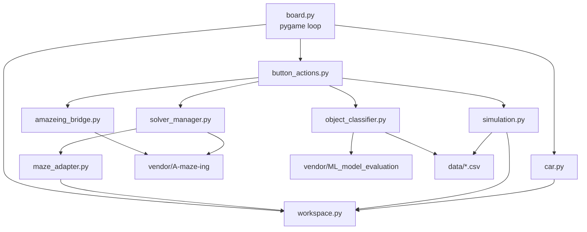
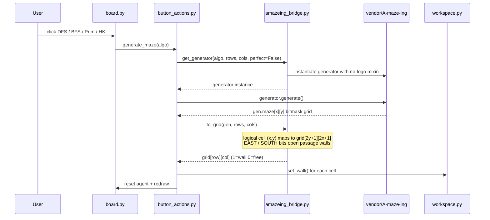
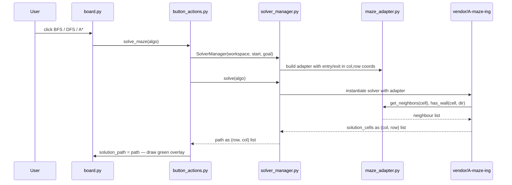
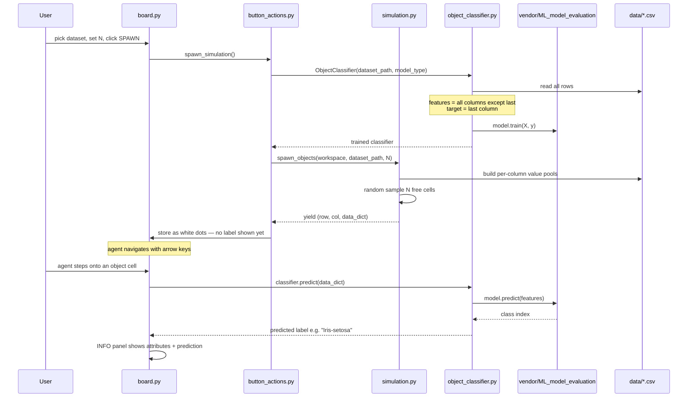

# Micro Mouse Maze

A pygame maze simulation where an agent navigates procedurally generated mazes, solves them with pathfinding algorithms, and classifies objects spawned from real datasets using machine learning.

Part of the ML lab course — a starting ground for building a space-exploring ML platform for agent AI robots.

## Quick Start

```bash
make pull        # clone vendor dependencies
python run_gui.py
```

Controls: **arrow keys** or D-pad buttons to move · click grid cells to toggle walls.

---

## Architecture

```
micro_mouse/
├── run_gui.py                   entry point
├── config.json                  runtime config (dataset, model, n_objects…)
├── data/                        CSV datasets for simulation
│   ├── Iris.csv
│   └── wdbc.data.csv
├── src/
│   ├── workspace.py             grid state (1=wall, 0=free)
│   ├── car.py                   agent: position, direction, movement
│   ├── simulation.py            spawn_objects() generator
│   ├── generators/
│   │   └── amazeing_bridge.py   vendor wrapper — get_generator(), to_grid()
│   ├── solvers/
│   │   ├── maze_adapter.py      bridges Workspace → vendor solver interface
│   │   └── solver_manager.py    BFS / DFS / A* via vendor, returns (row,col) path
│   ├── models/
│   │   └── object_classifier.py trains on CSV, predicts target column
│   └── gui/
│       ├── board.py             pygame main loop + rendering
│       └── button_actions.py    controller callbacks
└── vendor/                      populated by `make pull`
    ├── A-maze-ing/              maze generation + pathfinding
    └── ML_model_evaluation/     DecisionTree + SVM models
```

---

## Module Dependency Graph



---

## Flow 1 — Maze Generation



---

## Flow 2 — Pathfinding



---

## Flow 3 — Simulation & ML Classification



---

## Vendor Dependencies

| Repo | What it provides |
|---|---|
| [maya-fakih/A-maze-ing](https://github.com/maya-fakih/A-maze-ing) | Maze generators (DFS, BFS, Prim, Hunt-and-Kill) and pathfinding solvers (BFS, DFS, A*). Cells encoded as bitmasks; supports perfect (spanning-tree) or loopy mazes. |
| [maya-fakih/ML_model_evaluation](https://github.com/maya-fakih/ML_model_evaluation) | Decision Tree and SVM classifiers with a unified `.train(X, y)` / `.predict(X)` interface built on numpy. |

Run `make pull` to clone both into `vendor/`.

---

## Config

`config.json` controls the simulation defaults loaded at startup:

```json
{
    "dataset":      "Iris.csv",
    "model":        "tree",
    "n_objects":    20,
    "maze_algo":    "DFS",
    "perfect_maze": false
}
```

`perfect_maze: false` produces loopy mazes with multiple paths between cells.  
`perfect_maze: true` gives a strict spanning-tree maze (one unique path everywhere).
